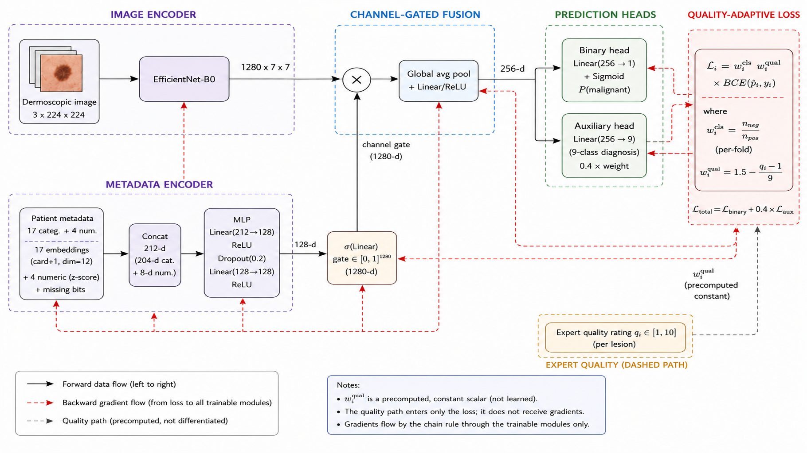
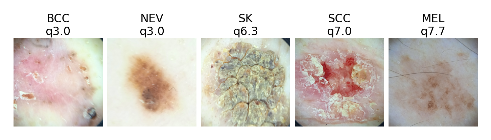
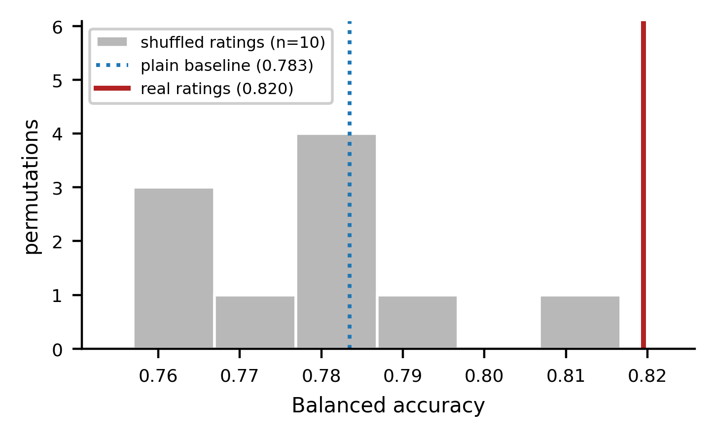
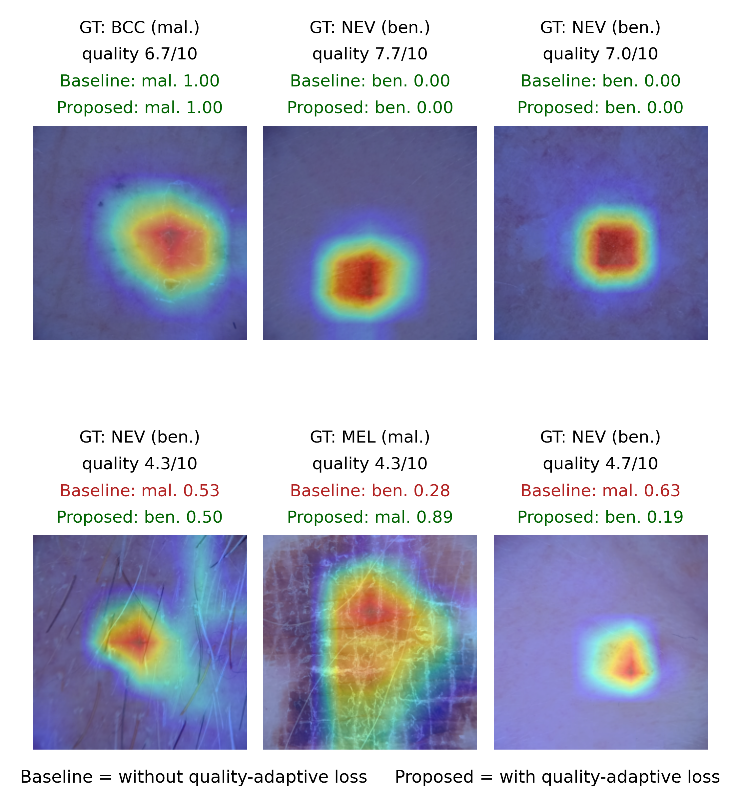
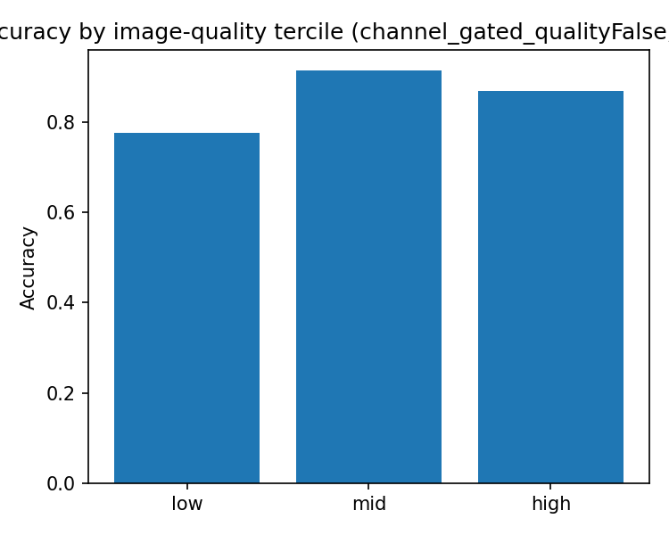
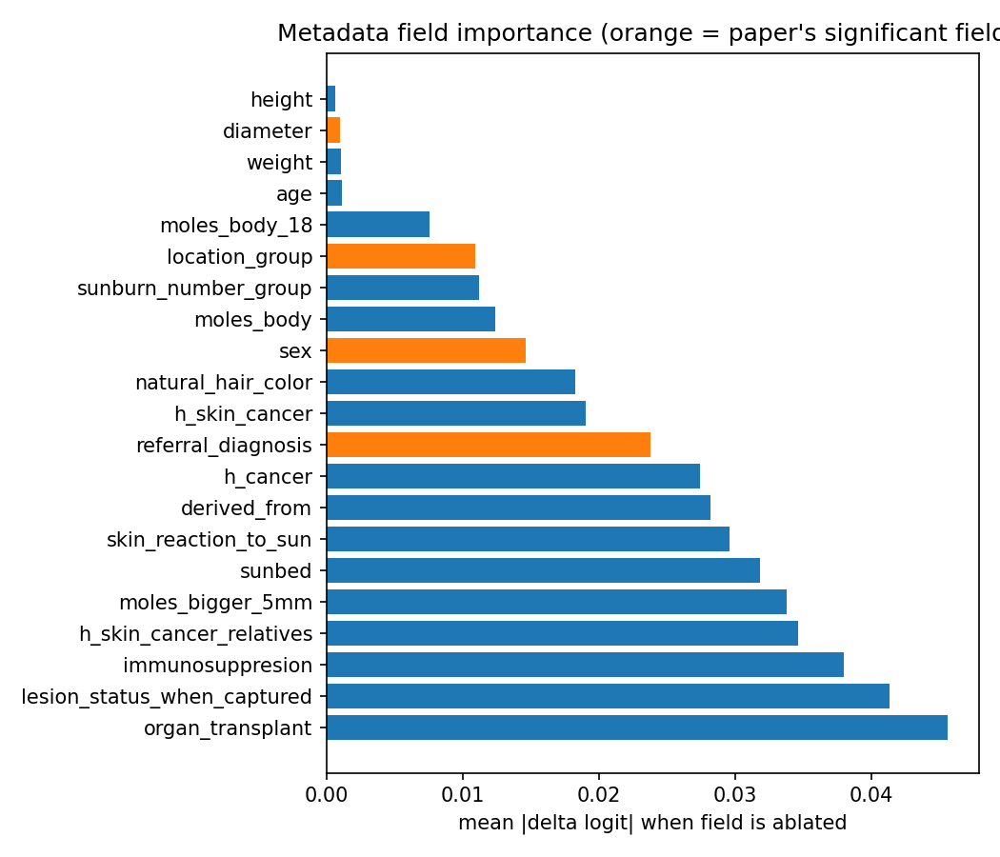

# Quality-Adaptive Loss Reweighting for Robust Skin Lesion Classification

**First published benchmark on the MCR-SL dataset — and a loss function that learns *harder* from the images experts rated *worse*.**

<sub>IEEE INDICON 2026 submission · dataset: [MCR-SL (Castro-Fernández et al., *Data* 2025)](https://zenodo.org/records/17306338) · 240 lesions / 60 subjects / 2131 images</sub>

---

## The one-paragraph version

Every quality-aware training method in the literature has had to *guess* how good an image is — AdaFace and MagFace read it off the feature norm, medical pipelines infer it from pseudo-labels — because no one records what an expert actually thought of the photograph. MCR-SL does. It ships a **1–10 diagnostic-quality rating assigned by dermatologists to the exact image each diagnosis was made from**. This project asks what happens when you put that real human judgment directly into the loss.

The answer is the opposite of what face recognition does. **Up-weighting the low-quality images** — forcing the model to work harder on exactly the samples the experts distrusted — improves balanced accuracy by **+0.037** and malignant sensitivity by **+0.092** over an identical baseline. And because a gain that size sits inside the fold-to-fold noise on a 240-lesion dataset, it is validated **causally, not statistically**: shuffle which lesion gets which rating, keep the weight distribution exactly the same, and the entire gain evaporates back to baseline.

---

## Headline numbers

| | balanced accuracy | sensitivity (malignant) | AUROC |
|---|---|---|---|
| Plain channel-gated baseline | 0.783 ± 0.076 | 0.672 ± 0.142 | 0.881 ± 0.058 |
| **+ quality-adaptive loss (`hard_mining`)** | **0.820 ± 0.078** | **0.764 ± 0.130** | 0.906 ± 0.059 |
| ↳ shuffled-rating control | 0.775 | 0.667 | — |
| **Best full configuration** *(+ TTA + multi-image averaging)* | **0.840 ± 0.095** | 0.783 ± 0.167 | **0.918 ± 0.058** |

**65% of the total gain over baseline is attributable to the quality-adaptive loss**; the rest is free evaluation-time averaging. Subject-disjoint stratified 5-fold CV throughout. Every number carries its standard deviation, and no two configurations within ~0.05 balanced accuracy are described as one beating the other.

---

## The contribution, in three lines of math

For lesion *i* with mean expert quality rating `q_i ∈ [1,10]`:

```
w_qual_i = 1.5 − (q_i − 1)/9        # rating 10 → 0.5,  rating 1 → 1.5   (low quality weighs MORE)
L_i      = w_cls_i · w_qual_i · BCE(ŷ_i, y_i)
L_total  = L_binary + 0.4 · L_aux
```

That is the whole method. No new architecture, no new layer, no learned quality module — `w_qual` is a **precomputed constant scalar that is never differentiated**. The quality signal enters the objective and nothing else.

Two opposing directions were tested. `trust` (down-weight low-quality samples, the face-recognition convention) is reported as a **null result** after its apparent gain failed the control. `hard_mining` (up-weight them) is the validated contribution — the intuition being that in dermoscopy a blurred, hair-occluded, poorly-framed lesion is not an unidentifiable face to be discounted, it is exactly the clinical image a deployed model will actually be handed.

---

## Architecture



Two encoders — EfficientNet-B0 over the dermoscopic image, and a 17-categorical + 4-numeric metadata embedding stack — meet at a **metadata-conditioned channel gate**: patient context produces a 1280-d sigmoid gate that rescales the convolutional feature map channel-by-channel *before* pooling. This is Squeeze-and-Excitation driven by the patient instead of by the feature map's own statistics, and it is used as an established component, **not claimed as novel**.

The novel path is the dashed one on the right. The expert rating never touches the forward pass, never receives a gradient, and never becomes a learnable parameter — it only decides how much each sample's error is allowed to matter.

Missing metadata is **never imputed**: every categorical field reserves an explicit "unknown" embedding index, and every numeric field carries a presence bit alongside its train-fold z-score.

---

## The dataset



<sub>Dermoscopic images with their unified diagnosis and mean expert quality rating (`q`). Note that quality and difficulty are not the same axis — the q3.0 BCC and the q7.7 melanoma are both hard, for different reasons.</sub>

MCR-SL is a brand-new descriptor paper with **zero prior benchmark or method papers** — this repository is the first. 240 lesions from 60 subjects, 779 clinical + 1352 dermoscopic images, 22 subject-level metadata fields, partial histopathology confirmation (29 lesions), CC-BY.

The quality rating exists for one image per lesion (the image the experts actually diagnosed from), across three of four experts — E002's ratings were lost to a documented technical error. That is ~231 usable (lesion, rating) pairs, and every analysis here states its N.

---

## Causal validation, not a p-value



The gain is comparable in size to the fold-to-fold standard deviation, so significance testing on 5 folds would be theatre. Instead: **permute the lesion-to-rating assignment within each training fold**, preserving the weight *distribution* exactly while destroying its *information content*, and retrain.

| | balanced accuracy | sensitivity |
|---|---|---|
| plain baseline | 0.783 | 0.672 |
| **`hard_mining` (real ratings)** | **0.820** | **0.764** |
| `hard_mining` (shuffled ratings) | 0.775 | 0.667 |

The shuffled control lands *on* the plain baseline — fractionally below it. Across 10 permutation seeds the null sits at 0.778 ± 0.017 against a real 0.820. Generic per-sample reweighting recovers **none** of the benefit, which is the evidence that the model is exploiting what the ratings mean, not the fact that they vary.

---

## What the model actually looks at



Grad-CAM on the out-of-fold predictions, baseline versus proposed, on the same lesions. The top row is the easy regime — both models localise the lesion and both are right. The bottom row is where the quality-adaptive loss earns its place: three low-quality lesions (q4.3–4.7, hair occlusion, poor framing, low contrast) that the baseline gets **wrong** and the proposed model gets **right**, including a melanoma the baseline called benign at 0.28 and the proposed model calls malignant at 0.89.

---

## Six robustness analyses — three of which reversed

This is the part of the project most worth reading. On a 240-lesion dataset, an uncontrolled first look reliably produces plausible positives that controls dissolve.

| # | analysis | outcome |
|---|---|---|
| 1 | Quality-stratified performance (terciles) | **Null.** Non-monotonic (0.776 / 0.914 / 0.868), Spearman ρ=−0.093, p=0.158 |
| 2 | Auxiliary quality-prediction head | **Negative.** Worse on every metric; tercile gap *widened* 0.091 → 0.101 |
| 3 | Histopathology-confirmed (n=28) vs. panel consensus (n=203) | Model does **worse** on histopath-confirmed lesions (0.75 vs 0.87) — histopathology gets ordered for the ambiguous ones. Qualitative only |
| 4 | Metadata field importance vs. the dataset paper's own significance tables | Categorical fields the dataset paper flagged (`referral_diagnosis`, `sex`, `location_group`) rank in the upper half; all four numeric fields rank last — an architectural capacity artifact, flagged not fixed |
| 5 | Diagnostic certainty vs. image quality | **Reversed.** A clean pooled ρ=−0.175 (p=0.008) is almost entirely class-mix confound; nothing survives stratification by malignancy |
| 6 | Intra-subject error clustering (55 subjects) | **Clean null.** Zero subjects fail on all their lesions; observed consistency *below* chance (p=0.954) — no per-patient confound hiding behind the subject-disjoint split |

Three conclusions were walked back by follow-up controls: `trust`'s tercile-gap narrowing, the pooled certainty correlation, and the premise of an "all-images" experiment that turned out to already be true. Those reversals are reported in the paper rather than quietly dropped.

<p align="center">
  
  
</p>

---

## Core ablation matrix

| variant | accuracy | balanced acc | macro-F1 | sensitivity | specificity | AUROC |
|---|---|---|---|---|---|---|
| Image-only (EfficientNet-B0) | 0.813 | 0.784 | 0.733 | 0.697 | 0.872 | 0.895 |
| + metadata, late fusion (concat) | 0.831 | 0.768 | 0.743 | 0.644 | 0.891 | 0.851 |
| + metadata, channel-gated | 0.833 | 0.783 | 0.757 | 0.672 | 0.895 | 0.881 |
| + auxiliary quality head | 0.812 | 0.740 | 0.715 | 0.578 | 0.902 | 0.879 |
| **+ quality-adaptive loss** | **0.845** | **0.820** | **0.778** | **0.764** | 0.875 | **0.906** |

**Channel-gated fusion is not a clean win over image-only** — it loses on balanced accuracy and sensitivity, and it is reported that way. The fusion architecture is scaffolding; the loss is the result. 27 configurations were run in total (SAM, focal, TTA, SWA, LDAM, contrastive, preprocessing, and every stack of them), all logged including the negatives, in [`results/FINDINGS.md`](results/FINDINGS.md).

---

## Repository

```
data/        schema validation (runs first, fails loudly), subject-disjoint folds, loaders
models/      image encoder · metadata encoder · channel-gated fusion · heads · SAM
train.py     all variants behind flags, incl. --shuffle-quality-control
evaluate.py  5-fold aggregation, confusion matrices, OOF predictions
robustness_analysis.py   analyses 1–4
scripts/     analyses 5–6, permutation control, Grad-CAM, figure export, remote runners
results/     FINDINGS.md (the full lab notebook) · results_ledger.csv (append-only) · figures
paper/       IEEE INDICON 2026 manuscript + figures
```

Two rules the repo enforces on itself: **schema validation runs before any training code** and fails on column/dtype/value-set drift rather than coercing, and the results ledger is **append-only** — negative results are paper material, not something to hide.

```bash
python -m data.validate_schema          # always first
bash scripts/run_full_experiment_matrix.sh
bash scripts/run_quality_adaptive_loss.sh
bash scripts/run_shuffled_quality_control.sh   # the control that makes the claim
```

---

## Honest limitations

- **N=234 usable lesions, ~8–9 malignant per test fold.** One lesion flipping moves fold sensitivity by ~0.12. Per-fold balanced accuracy on the best config spans 0.738 → 0.964.
- The remaining fold-to-fold variance was diagnosed as an **inherent small-N sampling floor**, not a fixable pipeline artifact — SWA, threshold recalibration, and checkpoint ensembling were all tried or ruled out on that basis.
- A systematic ~16% `pos_weight` miscalibration is documented as a methodological caveat rather than silently patched on the last day.
- The 9-class auxiliary task has classes with <10 lesions (MEL=8, SCC=5, ANG=4, DF=2) and is reported as exploratory only, flagged in every table.
- **No SOTA claim is made.** There is no prior MCR-SL number to beat, and the cross-dataset comparison to DiffMIC (0.840 vs 0.836) is well inside the noise.

---

## Citation

If you use this benchmark or the quality-adaptive loss:

```bibtex
@inproceedings{mcrsl2026qaloss,
  title  = {Quality-Adaptive Loss Reweighting Using Expert-Assigned Image Quality
            for Robust Skin Lesion Classification},
  author = {Sudhakar, Sudarshan},
  booktitle = {IEEE INDICON},
  year   = {2026}
}
```

Dataset: Castro-Fernández et al., *MCR-SL: A Multimodal Clinical Records dataset for Skin Lesions*, Data (2025). [10.5281/zenodo.17306338](https://doi.org/10.5281/zenodo.17306338)
